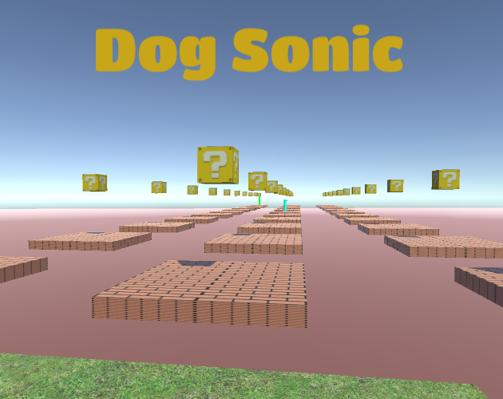

  

## Play

Game page on itch.io: https://guibdbello.itch.io/dog-sonic

  

  

### How to Play

When you see a civilian throwing trash in the street, get closer and click on him with your mouse to start a conversation, then click on the trash he has thrown away to aware him to pick it up and toss it in the trash bin.

#### Controls

- **WASD**: Move.
- **Mouse**: Look.
- **Space**: Jump.
- **Shift**: Run/Sprint.
- **Ctrl**: Crouch.

## About

Unexpected Platform Game. It's like Cat Mario (hence the name), but in first person.

### Game Jam

This game was made for the game jam [**Unexpected Jam**](https://itch.io/jam/unexpectedjam) which took place between August 29th and September 13th of 2020.

Theme: **Unexpected**.

## Setup

### Installation

1. Clone repository: `git clone https://github.com/GuiBDBello/DogSonic.git`.
2. Add the project to Unity Hub: `ADD > Select the folder you just cloned`.
3. Select the project to open.

### Development

1. Use Unity interface to change the levels.
2. Use your favorite IDE/Text Editor to code (I recommend Visual Studio or Visual Studio Code).

**Obs.:** Some links that may be helpful:

- https://learn.unity.com
- https://www.youtube.com/channel/UCYbK_tjZ2OrIZFBvU6CCMiA

### Build

1. In Unity, with the project open, go to `File > Build Settings...` then select `Build`.

## Credits

### Textures:

- Grass: https://br.pinterest.com/pin/367254544608654295/
- Mario Box: http://fav.me/d1wxrl7

### Sounds:

- Bensound (main menu music): https://www.bensound.com/royalty-free-music/track/relaxing
- Super Mario Bros. (NES) Sound Clips: https://themushroomkingdom.net/media/smb/wav
- vgmpf (game music): http://www.vgmpf.com/Wiki/images/f/f0/01_-_Syobon_Action_-_W32_-_Titerman.ogg
