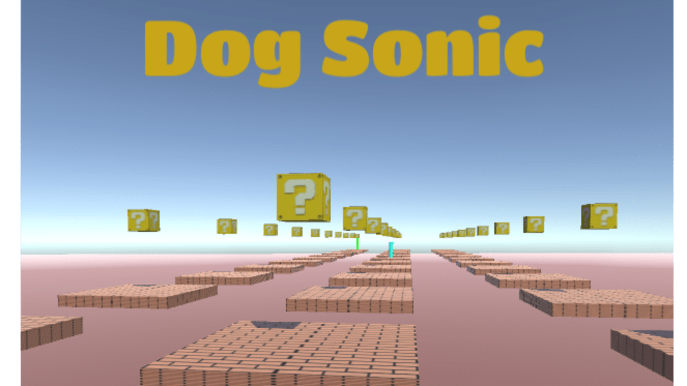

  

  Unexpected Platform Game.
   
   
  <a href="https://guibdbello.itch.io/dog-sonic">Play Game</a>
  ·
  <a href="https://github.com/GuiBDBello/DogSonic/issues/new?labels=bug&template=bug-report---.md">Report Bug</a>
  ·
  <a href="https://github.com/GuiBDBello/DogSonic/issues/new?labels=enhancement&template=feature-request---.md">Request Feature</a>

## Table of Contents

<ol>
  <li><a href="#introduction">Introduction</a></li>
  <li><a href="#getting-started">Getting Started</a></li>
  <li><a href="#build-process">Build Process</a></li>
  <li><a href="#acknowledgments">Acknowledgments</a></li>
  <li><a href="#license">License</a></li>
</ol>

## Introduction

It's like Cat Mario (hence the name), but in first person.

  

  

### How to Play

- **WASD**: Move.
- **Mouse**: Look.
- **Space**: Jump.
- **Shift**: Run/Sprint.
- **Ctrl**: Crouch.

### Game Jam

This game was made for the game jam [Unexpected Jam](https://itch.io/jam/unexpectedjam), which took place between August 29th and September 13th of 2020.

Theme: **Unexpected**.

(<a href="#readme-top">back to top</a>)

## Getting Started

To get a local copy up and running follow the steps below.

### Prerequisites

1. [Unity](https://unity.com/download)

### Configuration

1. Clone repository: `git clone https://github.com/GuiBDBello/Conscientize.git`.
1. Add the project to Unity or Unity Hub: `ADD > Select the folder you just cloned`.
1. Open project.

(<a href="#readme-top">back to top</a>)

## Build Process

1. With your project opened in Unity, select `File > Build Settings...`.
1. Select the `Platform` that you wish to build for (you may have to install a build module if you don't have it already installed).
1. Select `Build` or `Build And Run`.

(<a href="#readme-top">back to top</a>)

(<a href="#readme-top">back to top</a>)

## Acknowledgments

List of references that were useful in the making of this project:

* [Unity Learn](https://learn.unity.com/)
* [Brackeys](https://www.youtube.com/channel/UCYbK_tjZ2OrIZFBvU6CCMiA)

### Assets

| Name | Type | Creator | Source |
| --- | --- | --- | --- |
| Grass | Texture | [Google](https://br.pinterest.com/google/) | [Pinterest](https://br.pinterest.com/pin/367254544608654295/) |
| Mario Box | Texture | [ElectricCoffee](https://www.deviantart.com/electriccoffee/gallery) | [Deviant Art](http://fav.me/d1wxrl7) |
| Game Theme Song | Audio | [Chiku](https://www.vgmpf.com/Wiki/index.php/Syobon_Action_(W32)#Music) | [Video Game Music Preservation Foundation](http://www.vgmpf.com/Wiki/images/f/f0/01_-_Syobon_Action_-_W32_-_Titerman.ogg) |
| Main Menu Theme Song | Audio | [Benjamin Tissot](https://www.bensound.com/royalty-free-music?composer=84) | [Bensound](https://www.bensound.com/royalty-free-music/track/relaxing) |
| Super Mario Bros. (NES) Sound Clips | Audio | [Deezer](https://themushroomkingdom.net/media/smb/wav) | [The Mushroom Kingdom](https://themushroomkingdom.net/media/smb/wav) |

(<a href="#readme-top">back to top</a>)

## License

Distributed under the MIT License. See [LICENSE](./LICENSE) for more information.

(<a href="#readme-top">back to top</a>)

